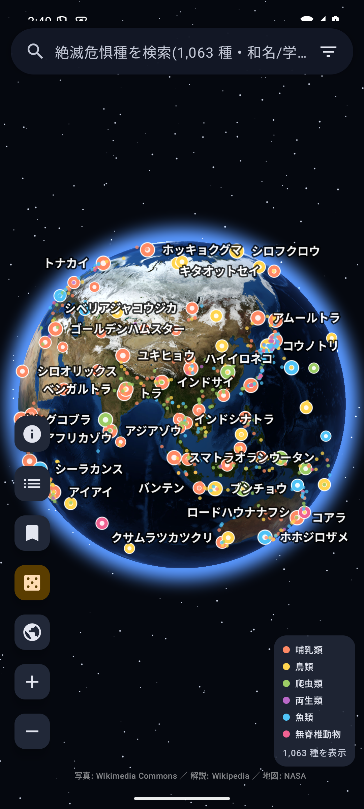
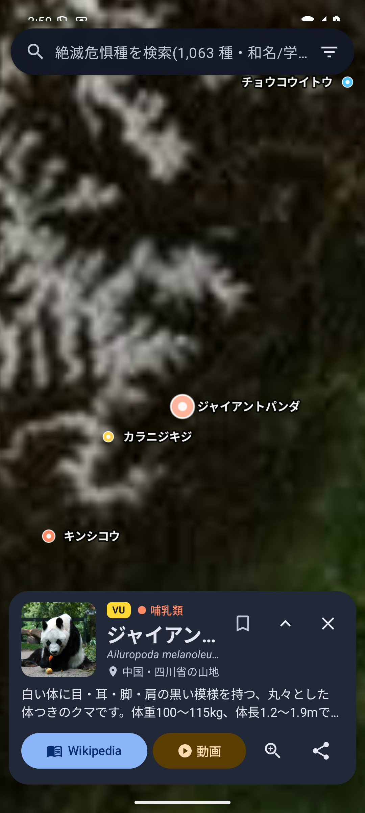
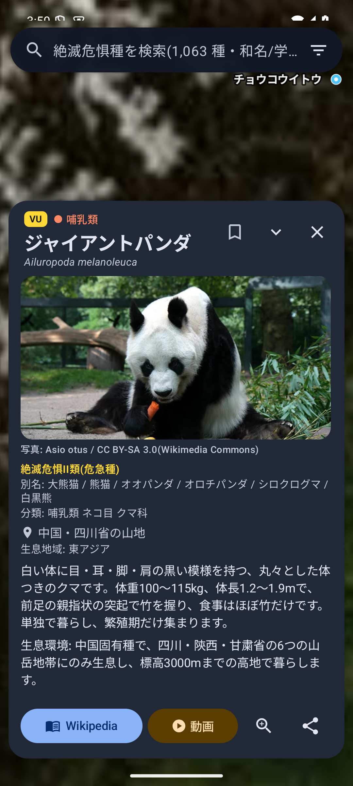
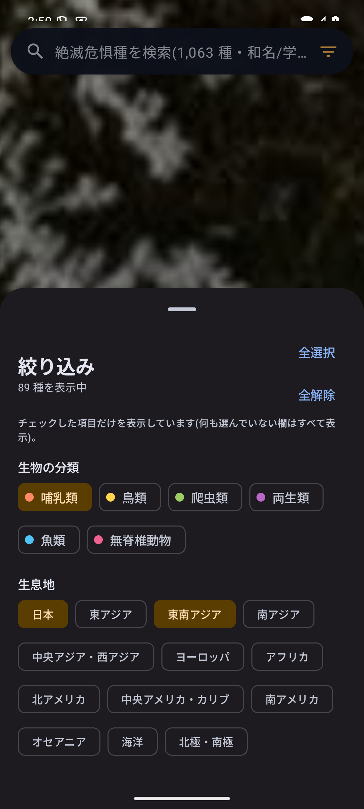
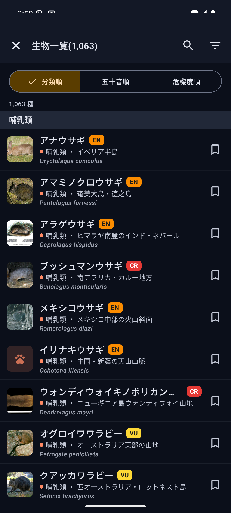
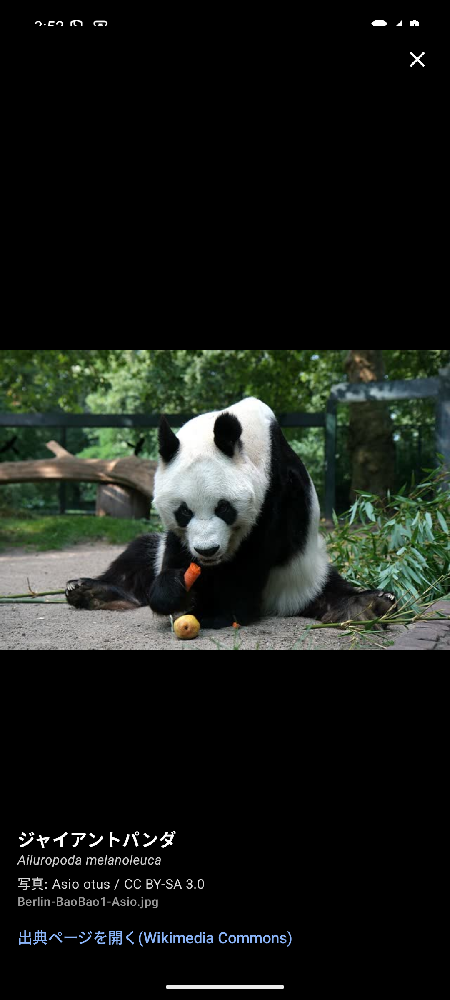

# 地球儀で見る絶滅危惧種生物図鑑

リアルな 3D 地球儀の上に、IUCN レッドリストで絶滅のおそれがあると評価された動物(CR / EN / VU、約 1,000 種)を
代表的な生息地のピンとして配置し、タップすると**写真**と**解説**、**Wikipedia** の記事と関連する **YouTube** 動画の検索結果を
アプリ内で開ける Android アプリです。地図画像・写真・解説はアプリに同梱しており、図鑑の閲覧はオフラインでも動きます。

写真・データはすべて第三者の利用が自由な情報源(Wikimedia Commons の自由ライセンス画像、Wikipedia、Wikidata、GBIF、NASA)から取得し、
出典とライセンスをアプリ内に表示しています(`NOTICE.md`、`docs/CREDITS.md`)。

## スクリーンショット

| 地球儀 | 種の詳細カード | 詳細を展開(写真・生息地・脅威) | 絞り込み(分類・生息地) | 生物一覧 | 写真の全画面表示 |
|:---:|:---:|:---:|:---:|:---:|:---:|
|  |  |  |  |  |  |

## 特徴

### 地球儀
- OpenGL ES による自前の地球儀レンダラ。NASA Blue Marble を 5 段階のタイル(約 42MB)で同梱し、オフラインで動作。
- ドラッグ回転・慣性・ピンチズーム・ダブルタップ拡大(「指の下の地点を保つ」操作)。
- ピンの色は生物の分類(哺乳類・鳥類・爬虫類・両生類・魚類・無脊椎動物)。画面上で自動間引き・ラベル配置し、ズームすると同じ場所の種を円状に展開。
- 大気のグロー・星空・球の陰影で立体的に表示。右下に分類の凡例と表示中の種数。

### 種を探す
- **検索**: 和名・別名・学名・目・科・生息地名で検索。表記ゆれ(全半角、ひらがな/カタカナ、「ヴ/バ」表記)に対応。
- **絞り込み**(検索バー右の絞り込みボタン): **生物の分類**(魚類・両生類・爬虫類・哺乳類・鳥類・無脊椎動物)と**生息地**(日本・東アジア・東南アジア・南アジア・中央アジア/西アジア・ヨーロッパ・アフリカ・北アメリカ・中央アメリカ/カリブ・南アメリカ・オセアニア・海洋・北極/南極)。
  - アプリ起動時はすべて表示(全選択の状態)。
  - 絞り込みを開くと初期状態はすべて未選択(全解除)で、見たい項目だけチェックして表示します。
  - 右上の「全選択」の下に「全解除」。何も選ばずに閉じることはできず、「何も選択されていません」と案内します。片方の欄が未選択ならその欄では絞りません(例: 「哺乳類」だけなら全地域の哺乳類)。
  - 複数の地域に生息する種は、そのいずれかをチェックすれば表示されます。
- ランダム表示、地球全体へ戻る操作。

### 種の詳細
- 写真(タップで全画面・ピンチ拡大)、IUCN カテゴリ(CR / EN / VU)、分類(目・科)、学名、代表的な生息地、生息地域。
- 展開すると解説・生息環境・主な脅威と、写真の作者・ライセンス(Wikimedia Commons)を表示。
- 「Wikipedia」で記事を、「動画」で種名の YouTube 検索結果を、いずれもアプリ内ブラウザで表示。共有も可能。

### 生物一覧
- 全種の一覧を**分類順 / 五十音順 / 危機度順**で表示。一覧内の検索、分類・生息地での絞り込み(全選択・全解除あり)。
- 一度でも開いた種には**既読マーク**、**ブックマーク**(最大 1,000 件)。ブックマークも同じ一覧 UI で表示。

## データと出典
- **写真**: Wikimedia Commons の自由ライセンス画像(CC0 / パブリックドメイン / CC BY / CC BY-SA)のみ。作者とライセンスは各写真と「写真の出典一覧」に表示。
- **解説・生息環境・脅威**: Wikipedia 日本語版・英語版の記事冒頭をもとに要約(CC BY-SA 4.0、本文は同梱せずブラウザ表示)。
- **和名・学名・分類・IUCN カテゴリ**: Wikidata(CC0)。評価は Wikidata に記録された時点のもの。
- **ピンの位置**: 各種の代表的な生息地 1 か所(Wikipedia の分布記述・Wikidata の固有分布・GBIF の CC0 / CC BY 4.0 出現記録を参考に整理)。
- **地球画像**: NASA Blue Marble: Next Generation(パブリックドメイン)。アプリアイコンも同画像から生成。
- 詳細は `NOTICE.md`、生成手順は `docs/DATA.md` を参照。

## プライバシー
- 個人情報を収集・送信しません。既読・ブックマークは端末内にのみ保存されます。詳細は `docs/PRIVACY.md`。

## ビルド
```bash
./gradlew assembleDebug      # デバッグ APK
./gradlew bundleRelease      # 署名済み AAB(keystore.properties が必要)
```
`local.properties` に `sdk.dir` を設定してください(compileSdk 36 / minSdk 30)。
リリース手順は `docs/RELEASE.md`、Google Play 提出の準備は `docs/PLAY_STORE.md` を参照してください。

## ライセンス
- アプリ本体: MIT License(`LICENSE`)
- 同梱データ・画像の出典と条件: `NOTICE.md`、`docs/CREDITS.md`
